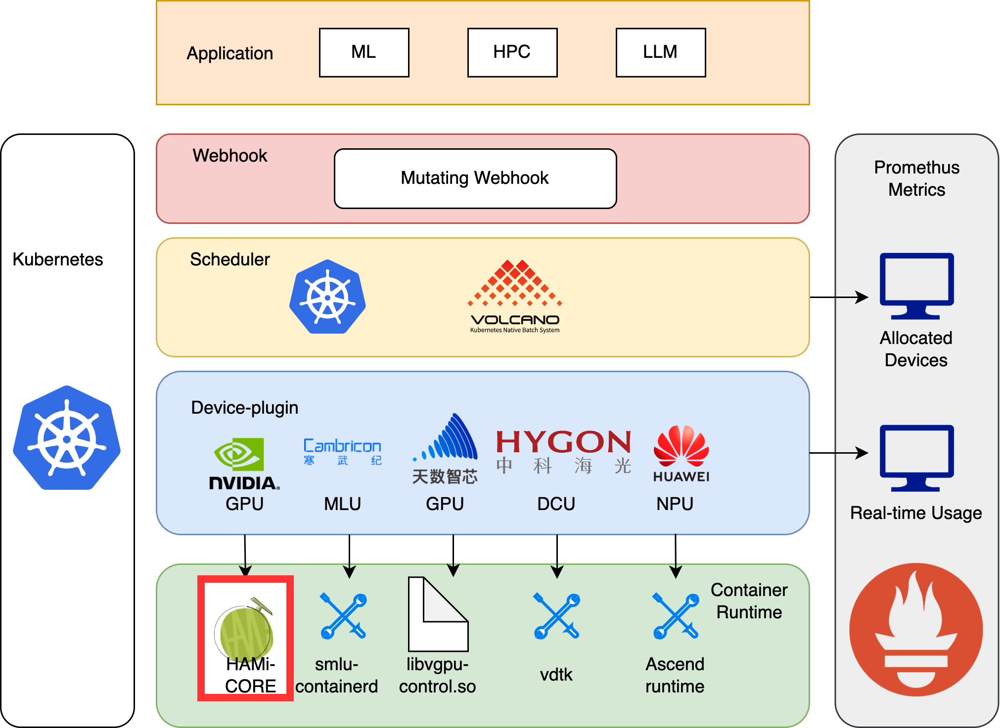

# HAMi-core —— Hook library for CUDA Environments

## Introduction

HAMi-core is the in-container gpu resource controller, it has beed adopted by [HAMi](https://github.com/HAMi-project/HAMi), [volcano](https://github.com/volcano-sh/devices)

 

## Features

HAMi-core has the following features:
1. Virtualize device meory


2. Limit device utilization by self-implemented time shard

3. Real-time device utilization monitor 

## Build

```bash
sh build.sh
```

## Build in Docker

```bash
docker build . -f dockerfiles/Dockerfile.{arch}
```

## Usage

_CUDA_DEVICE_MEMORY_LIMIT_ indicates the upper limit of device memory (eg 1g,1024m,1048576k,1073741824) 

_CUDA_DEVICE_SM_LIMIT_ indicates the sm utility percentage of each device

```bash
# Add 1GB bytes limit And set max sm utility to 50% for all devices
export LD_PRELOAD=./libvgpu.so
export CUDA_DEVICE_MEMORY_LIMIT=1g
export CUDA_DEVICE_SM_LIMIT=50
```

## Docker Images
```bash
# Make docker image
docker build . -f=dockerfiles/Dockerfile-tf1.8-cu90

# Launch the docker image
export DEVICE_MOUNTS="--device /dev/nvidia0:/dev/nvidia0 --device /dev/nvidia-uvm:/dev/nvidia-uvm --device /dev/nvidiactl:/dev/nvidiactl"
export LIBRARY_MOUNTS="-v /usr/cuda_files:/usr/cuda_files -v $(which nvidia-smi):/bin/nvidia-smi"

docker run ${LIBRARY_MOUNTS} ${DEVICE_MOUNTS} -it \
    -e CUDA_DEVICE_MEMORY_LIMIT=2g \
    cuda_vmem:tf1.8-cu90 \
    python -c "import tensorflow; tensorflow.Session()"
```

## Log

Use environment variable LIBCUDA_LOG_LEVEL to set the visibility of logs

| LIBCUDA_LOG_LEVEL | description |
| ----------------- | ----------- |
|  0          | errors only |
|  1(default),2          | errors,warnings,messages |
|  3                | infos,errors,warnings,messages |
|  4                | debugs,errors,warnings,messages |


## Test Raw APIs

```bash
./test/test_alloc
```
