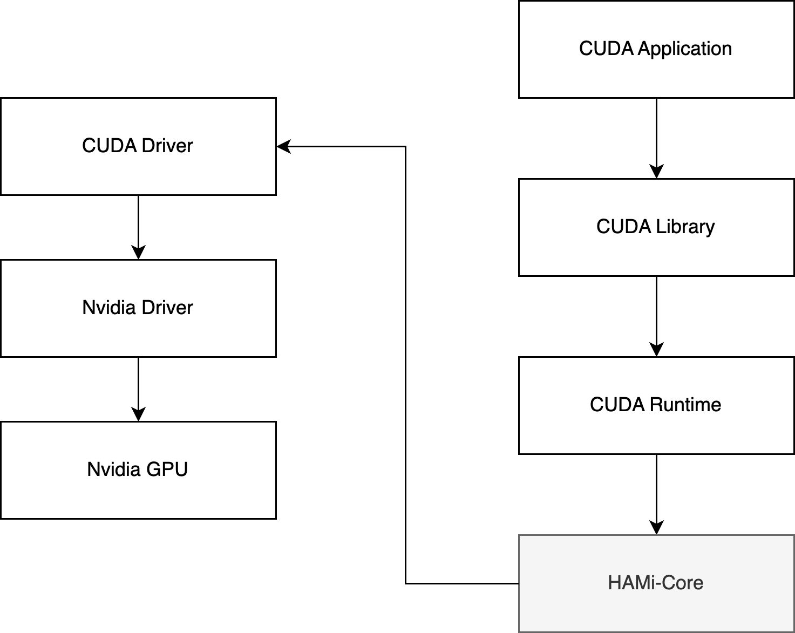

# SoftMig - Software GPU Slicing for SLURM Clusters

**SoftMig** is a fork of [HAMi-core](https://github.com/Project-HAMi/HAMi-core) optimized for **Digital Research Alliance Canada (DRAC) / Compute Canada** SLURM environments. It provides software-based GPU memory and compute cycle limiting for oversubscribed GPU partitions.

**Original Project**: [HAMi-core](https://github.com/Project-HAMi/HAMi-core) - in-container GPU resource controller adopted by [HAMi](https://github.com/Project-HAMi/HAMi) and [volcano](https://github.com/volcano-sh/devices)

## What is SoftMig?

**softmig** = **Soft**ware **MIG** (Multi-Instance GPU)

Like NVIDIA's hardware MIG (available on A100/H100), softmig provides software-based GPU slicing for any GPU, enabling:
- **GPU Memory Slicing**: Divide GPU memory among multiple jobs (e.g., 12GB, 24GB slices on 48GB GPUs)
- **GPU Compute Slicing**: Limit SM utilization per job (e.g., 25%, 50% of GPU cycles)
- **Oversubscription**: Run 2-8 jobs per GPU safely

## Features

1. **Virtualize device memory**: Limit GPU memory per job
2. **Limit device utilization**: Control SM utilization percentage via time sharding
3. **Real-time device utilization monitor**: Track GPU usage across multiple jobs
4. **SLURM Integration**: Uses `SLURM_TMPDIR`, `SLURM_JOB_ID` for proper isolation
5. **Silent Operation**: No user-visible logs (file-only logging)
6. **Secure Configuration**: Reads limits from secure config files (users cannot modify)
7. **Multi-CUDA Support**: Works with CUDA 11, 12, 13 (build with CUDA 11 headers)

## Design

softmig operates by hijacking API calls between CUDA-Runtime(libcudart.so) and CUDA-Driver(libcuda.so), as shown below:



## Building

```bash
# Build with CUDA 11 headers for maximum compatibility (works with CUDA 11, 12, 13)
export CUDA_HOME=/path/to/cuda-11.8
./build.sh

# The library will be built as: build/libsoftmig.so

# Install to system location (as admin)
sudo mkdir -p /var/lib/shared
sudo cp build/libsoftmig.so /var/lib/shared/
sudo chmod 755 /var/lib/shared/libsoftmig.so

# Or alternative location:
# sudo mkdir -p /opt/softmig/lib
# sudo cp build/libsoftmig.so /opt/softmig/lib/
```

## Usage

### Configuration Method

**In SLURM jobs**: softmig reads limits from secure config files in `/var/run/softmig/{jobid}_{arrayid}.conf` (created by `task_prolog.sh`). Users cannot modify these files, ensuring limits are enforced.

**Outside SLURM (testing)**: softmig falls back to environment variables if no config file exists.

### Environment Variables (Fallback for Non-SLURM)

- `CUDA_DEVICE_MEMORY_LIMIT`: Upper limit of device memory (e.g., `1g`, `24G`, `1024m`, `1048576k`, `1073741824`)
- `CUDA_DEVICE_SM_LIMIT`: SM utilization percentage (0-100)
- `LD_PRELOAD`: Path to `libsoftmig.so` library
- `LIBCUDA_LOG_LEVEL`: Log verbosity (0=errors only, 4=debug, default 0)
- `SOFTMIG_LOG_FILE`: Custom log file path (optional)
- `SOFTMIG_LOCK_FILE`: Custom lock file path (optional)

### Basic Test Example

```bash
# In your SLURM job script or interactive session:

# 1. DELETE the cache file FIRST (important when changing limits!)
rm -f ${SLURM_TMPDIR}/cudevshr.cache*

# 2. Set your memory limit (for testing - in production, limits come from config file)
export CUDA_DEVICE_MEMORY_LIMIT=16g

# 3. Load the library (adjust path to your installation)
export LD_PRELOAD=/var/lib/shared/libsoftmig.so
# Or: export LD_PRELOAD=/opt/softmig/lib/libsoftmig.so
# Or if testing from build directory: export LD_PRELOAD=/path/to/HAMi-core/build/libsoftmig.so

# 4. Test with nvidia-smi (should show limited memory)
nvidia-smi
```

**Working Example** (from Compute Canada cluster):
```bash
# Build the library
module load cuda/12.2
rm -rf build && ./build.sh

# In your job or interactive session:
# 1. Delete cache
rm -f ${SLURM_TMPDIR}/cudevshr.cache*

# 2. Set limit
export CUDA_DEVICE_MEMORY_LIMIT=16g

# 3. Load library (from build directory for testing)
export LD_PRELOAD=/project/def-rahimk/rahimk/hami-2/HAMi-core/build/libsoftmig.so

# 4. Test
nvidia-smi
# Should show: 0MiB / 16384MiB (16GB limit)
```

### Python/PyTorch Example

```bash
# In your SLURM job:
export LD_PRELOAD=/var/lib/shared/libsoftmig.so
export CUDA_DEVICE_MEMORY_LIMIT=12g
export CUDA_DEVICE_SM_LIMIT=50  # Optional: limit to 50% SM utilization

# Clear cache
rm -f ${SLURM_TMPDIR}/cudevshr.cache*

# Run your Python script
python your_script.py
```

### For SLURM Users

Once deployed, simply request GPU slices:

```bash
# Request half GPU slice (24GB, 50% SM)
sbatch --gres=gpu:l40s.2:1 --time=2:00:00 job.sh

# Request quarter GPU slice (12GB, 25% SM)
sbatch --gres=gpu:l40s.4:1 --time=5:00:00 job.sh

# Request eighth GPU slice (6GB, 12% SM)
sbatch --gres=gpu:l40s.8:1 --time=1:00:00 job.sh

# Full GPU (no limits)
sbatch --gres=gpu:l40s:1 --time=2:00:00 job.sh
```

The `task_prolog.sh` automatically configures limits based on the requested GPU slice type.

## Memory Limits by GPU Slice

| Slice Type | Memory | SM Limit | Oversubscription | Use Case |
|------------|--------|----------|------------------|----------|
| l40s.1 (full) | 48GB | 100% | 1x | Large models |
| l40s.2 (half) | 24GB | 50% | 2x | Medium models |
| l40s.4 (quarter) | 12GB | 25% | 4x | Small models |
| l40s.8 (eighth) | 6GB | 12% | 8x | Tiny models |

## File Locations

- **Cache files**: `$SLURM_TMPDIR/cudevshr.cache.*` (auto-cleaned when job ends)
- **Lock files**: `$SLURM_TMPDIR/vgpulock/lock.*` (per-job isolation)
- **Config files**: `/var/run/softmig/{jobid}_{arrayid}.conf` (created by task_prolog, deleted on exit)
- **Logs**: `/var/log/softmig/{user}_{jobid}_{arrayid}_{date}.log` (silent to users)

## Logging

Logs are written to `/var/log/softmig/{user}_{jobid}_{arrayid}_{date}.log` and are completely silent to users by default.

Use environment variable `LIBCUDA_LOG_LEVEL` to control log verbosity:

| LIBCUDA_LOG_LEVEL | description |
| ----------------- | ----------- |
|  0 (default)      | errors only (silent operation) |
|  2                | errors, warnings, messages |
|  3                | info, errors, warnings, messages |
|  4                | debug, info, errors, warnings, messages |

To view logs (as admin):
```bash
tail -f /var/log/softmig/*.log
```

## Deployment for Cluster Administrators

For complete deployment instructions, see **[docs/DEPLOYMENT_DRAC.md](docs/DEPLOYMENT_DRAC.md)**.

### Quick Setup Checklist

1. **Build and Install**:
   ```bash
   ./build.sh
   sudo mkdir -p /var/lib/shared /var/log/softmig /var/run/softmig
   sudo cp build/libsoftmig.so /var/lib/shared/
   sudo chmod 755 /var/lib/shared/libsoftmig.so /var/log/softmig /var/run/softmig
   ```

2. **SLURM Configuration**:
   - Update `gres.conf` with GPU slice definitions
   - Update `slurm.conf` with new partitions
   - Create/update `task_prolog.sh` (creates secure config files)
   - Create/update `task_epilog.sh` (cleanup)
   - Create/update `job_submit.lua` (job routing and validation)

3. **Example Configs**: See `docs/examples/` for:
   - `slurm_job_submit.lua`: Job routing and validation
   - `slurm_task_prolog.sh`: Automatic configuration
   - `slurm_task_epilog.sh`: Cleanup
   - `slurm_gres.conf`: GRES definitions
   - `slurm_partitions.conf`: Partition configurations

## Differences from Original HAMi-core

| Feature | HAMi-core | softmig |
|---------|-----------|---------|
| Target Environment | Docker/Kubernetes | SLURM clusters |
| Logging | `/tmp/vgpulog` | `/var/log/softmig/{user}_{jobid}_{date}.log` |
| Cache Location | `/tmp/cudevshr.cache` | `$SLURM_TMPDIR/cudevshr.cache.*` |
| User Visibility | Logs to stderr | Completely silent |
| Limit Validation | Cache-first | Config file → Environment-first |
| Isolation | Process-based | Job-based (SLURM_JOB_ID) |
| Configuration | Environment variables | Secure config files (SLURM) |

## Test Programs

```bash
# After building, test basic functionality
cd build
export LD_PRELOAD=./libsoftmig.so
export CUDA_DEVICE_MEMORY_LIMIT=1g
rm -f ${SLURM_TMPDIR}/cudevshr.cache* 2>/dev/null
./test/test_alloc
```

## Important Notes

- **Changing limits**: Always delete cache files before setting new limits
- **Config files**: In SLURM jobs, limits come from secure config files (users cannot modify)
- **Cache files**: Auto-cleaned when job ends (SLURM_TMPDIR is job-specific)
- **Multi-CUDA**: Build with CUDA 11 headers for compatibility with CUDA 11, 12, 13

## License

Same as original HAMi-core project.

## Acknowledgments

Based on [HAMi-core](https://github.com/Project-HAMi/HAMi-core) by Project-HAMi, optimized for Digital Research Alliance Canada / Compute Canada infrastructure.
